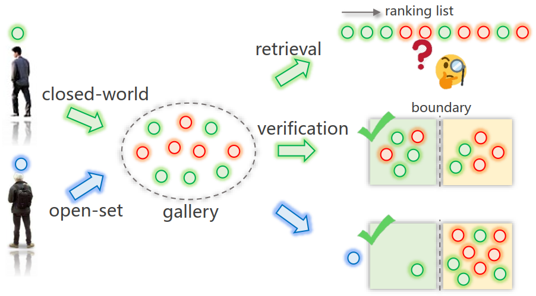

# Re-identification = Retrieval + Verification: Back to Essence and Forward with a New Metric
The *official* repository for [Re-identification = Retrieval + Verification: Back to Essence and Forward with a New Metric](https://arxiv.org/abs/2011.11506).



## Prerequisites
- Python3.0+
- Scipy=1.1.0
- Numpy=1.15.1

## Getting started
Check the Prerequisites. Then download GOM.py and test.py. Next put them in the same directory as you want.

## Part 1: Prepare data
Extract distance, gallery_label, gallery_cam, query_label, and query_cam for the different methods of ReID.

Save the data format as follows:
```
mat:{'distmat':distmat,'gallery_label':gallery_label,'gallery_cam':gallery_cam,'query_label':query_label,'query_cam':query_cam} # Save to Mat for testing
```

## Part 2: Testing
In test.py, you need to do the following simple operation:
```
Market1501 and DukeMTMC-reID
Supervised methods
method_name = ['ResNet-50', 'DenseNet-121', 'MLFN', 'HA-CNN', 'MobileNetV2', 'OSNet', 'AlignedReID', 'DG-Net', 'BDB', 'BagTricks', 'FastReID', 'AGW']
line_type = ['-', '--', '-.', '-', '--', '-.', '-', '--', '-.' ,'-', '--', '-.' ]
line_color = ['red', 'green', 'blue', 'tomato', 'sienna', 'darkorange', 'darkgoldenrod', 'gold', 'olive', 'yellow', 'lawngreen', 'palegreen']
line_width = [2, 2, 2, 2, 2, 2, 2, 2, 2, 2, 2, 2]

Unsupervised methods
method_name = ['PUL', 'ECN', 'UDA_TP', 'MMT', 'SpCL']
line_type = ['-', '--', '-.', '-', '--']
line_color = ['red', 'green', 'blue', 'tomato', 'sienna']
line_width = [2, 2, 2, 2, 2]

ViRi776
method_name = ['ResNet-50', 'VOC-ReID', 'BagTricks']
line_type = ['-', '--', '-.']
line_color = ['red', 'green', 'blue']
line_width = [2, 2, 2]
```
According to the format and name of ReID method in part 1. You need to modify the parameters of method_name, line_type and line_width.

Next, you can run the shell:
```
python test.py
```

Finally, you can get rank-1, mAP, mVP, mReP, MREP, MFR and the curve of mReP and mFR.

## Citation
If you find this code useful for your research, please cite our paper
```
@article{wang2020gom,
  title={Re-identification = Retrieval + Verification: Back to Essence and Forward with a New Metric},
  author={Wang, Zheng and Yuan, Xin and Yamasaki, Toshihiko and Lin, Yutian and Xu, Xin and Zeng, Wenjun},
  journal={arXiv preprint arXiv:2011.11506},
  year={2020}
}
```

